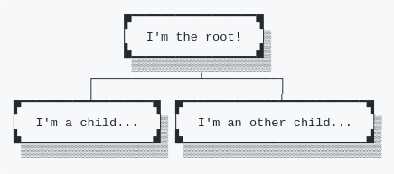
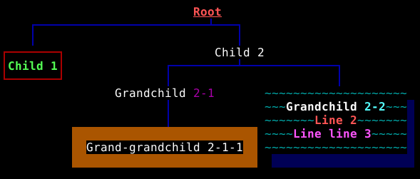

# Tree Printer &#x1F538; *now with colors (ANSI support)*

Simple Java library for visualizing tree structures in the command line.

```
natural foods
 ├─ fruits
 │  ├─ apple
 │  ├─ banana
 │  ├─ mango
 │  ├─ lorem and
 │  │  ipsum
 │  │ ┌──────────────────────────────────┐
 │  │ │            citroideae            │
 │  ├─│    ┌─────┬─────┴─┬─────────┐     │
 │  │ │ orange lemon grapefruit mandarin │
 │  │ └──────────────────────────────────┘
 │  │ ┌────────────────────────────────┐
 │  │ │         berries                │
 │  │ │     ┌──────┴───────┐           │
 │  └─│   grape          other         │
 │    │  ┌──┴─┐       ┌────┴─────┐     │
 │    │ red white strawberry raspberry │
 │    └────────────────────────────────┘
 ├─ vegetables
 │  ├─ tomato
 │  ├─ carrot
 │  │ A──────────B
 │  └─│ broccoli │
 │    D──────────C
 └─ seeds
    ├─ walnut
    └─ peanut
```

## Migration from 2.x to 3.x

Now coloring and other ANSI escapes are supported.
[See below for more information.](#coloring-and-other-ansi-formatters)

The following breaking changes was made:

- `TreeNode.content()` returns with `ConsoleText` (instead of `String`)

## Migration from 1.x to 2.x

The following breaking changes was made:

- Package/class structure was reorganized
- Method naming convention was changed (e. g. `getChildren()` &rarr; `children()`)
- Most of the telescoping constructors was removed (use builders instead)
- Decorator inheritance was simplified, `forceInherit` option was removed

Furthermore, many little changes, extensions and fixes was added.

## Using in projects

This library is open source, and available under the Apache License V2.

The library is compatible with java versions 1.8+.
See the `1.x` branch for using the legacy version (compatible with 1.6+).

Built packages are available from the Maven Central Repository.

In gradle projects:

```groovy

dependencies {
    implementation "hu.webarticum:tree-printer:${treePrinterVersion}"
}

```

In maven projects:

```xml
<dependency>
  <groupId>hu.webarticum</groupId>
  <artifactId>tree-printer</artifactId>
  <version>${treePrinterVersion}</version>
</dependency>
```

## Constructing trees

A *tree* is a hierarchical structure built from *nodes*.
Any tree is given by its root node.

Nodes implement the `TreeNode` interface.
It contains default implementations for the majority of its methods,
you must implement only the `content()` and `children()` methods.

You can use `SimpleTreeNode` out-of-the-box as a default string-based implementation:

```java
SimpleTreeNode rootNode = new SimpleTreeNode("I'm the root!");
rootNode.addChild(new SimpleTreeNode("I'm a child..."));
rootNode.addChild(new SimpleTreeNode("I'm an other child..."));
```

However, you are free to implement your custom nodes.

## Printing a tree

There are multiple built-in implementations of the `TreePrinter` interface
for printing tree structures via the `print()` method.
This method accepts a `TreeNode` (the root node of the printed hierarchy),
and, optionally, an `Appendable` object, to where the output will be flushed
(by default, output will be printed to `System.out`).

Alternatively, you can get the visualization as `String` via `stringify()`.
In some cases this is inefficient (especially when you print large data with `ListingTreePrinter`).

It is very easy to visualize the above structure:

```java
new ListingTreePrinter().print(rootNode);
```

And the result:

```
I'm the root!
 ├─I'm a child...
 └─I'm an other child...
```

Or use a `TraditionalTreePrinter`:

```java
new TraditionalTreePrinter().print(rootNode);
```

Which results:

```
           I'm the root!
       ┌─────────┴───────┐
       │                 │
I'm a child... I'm an other child...
```

For more available printers see the `hu.webarticum.treeprinter.printer.*` packages.

Of course, `TreePrinter` implementations have many options for controlling the output.
You can change the lining characters, the aligning, and so on.

Most classes have builders and some basic constructors for easy change of settings.
For example, if we want to align everything to left:

```java
new TraditionalTreePrinter(
        DefaultAligner.builder()
                .align(DefaultAligner.Alignment.LEFT)
        .build(),
        TraditionalTreePrinter.DEFAULT_LINER
).print(rootNode);
```

Result:

```
I'm the root!
├──────────────┐
│              │
I'm a child... I'm an other child...
```

## Using decorators

You can easily write node decorators by extending `AbstractTreeNodeDecorator`.
There are built-in implementations for adding
padding, border, shadow and other basic decorations.

In the previous example the child nodes are confused, because only a single space separates them.
It will be much cleaner if we added a border:

```java
new TraditionalTreePrinter().print(new BorderTreeNodeDecorator(rootNode));
```

Result:

```
            ┌─────────────┐
            │I'm the root!│
            └─────────────┘
        ┌──────────┴────────┐
        │                   │
┌──────────────┐ ┌─────────────────────┐
│I'm a child...│ │I'm an other child...│
└──────────────┘ └─────────────────────┘
```

Of course, you can compose as many decorators as you want:

```java
TreeNode decoratedTreeNode = new ShadowTreeNodeDecorator(
        BorderTreeNodeDecorator.builder()
                .wideUnicode()
                .buildFor(
                        new PadTreeNodeDecorator(rootNode, new Insets(0, 2))));

new TraditionalTreePrinter().print(decoratedTreeNode);
```

Result:

<!--
```
               ▛▔▔▔▔▔▔▔▔▔▔▔▔▔▔▔▔▔▜
               ▏  I'm the root!  ▕▒
               ▙▁▁▁▁▁▁▁▁▁▁▁▁▁▁▁▁▁▟▒
                ▒▒▒▒▒▒▒▒▒▒▒▒▒▒▒▒▒▒▒
          ┌──────────────┴──────────┐
          │                         │
▛▔▔▔▔▔▔▔▔▔▔▔▔▔▔▔▔▔▔▜  ▛▔▔▔▔▔▔▔▔▔▔▔▔▔▔▔▔▔▔▔▔▔▔▔▔▔▜
▏  I'm a child...  ▕▒ ▏  I'm an other child...  ▕▒
▙▁▁▁▁▁▁▁▁▁▁▁▁▁▁▁▁▁▁▟▒ ▙▁▁▁▁▁▁▁▁▁▁▁▁▁▁▁▁▁▁▁▁▁▁▁▁▁▟▒
 ▒▒▒▒▒▒▒▒▒▒▒▒▒▒▒▒▒▒▒▒  ▒▒▒▒▒▒▒▒▒▒▒▒▒▒▒▒▒▒▒▒▒▒▒▒▒▒▒
```
-->



Decorators inherit by default, but you can change this behavior.

## Placeholders

You can put placeholder nodes into the tree.
These nodes are hidden by default in the general printers.
Placeholders are useful in n-ary trees, where missing nodes matter.

```java
boolean displayPlaceholders = true;

SimpleTreeNode alignedTree = new SimpleTreeNode("ROOT");
alignedTree.addChild(new PlaceholderNode());
alignedTree.addChild(new SimpleTreeNode("RIGHT"));

new TraditionalTreePrinter(displayPlaceholders).print(
        PadTreeNodeDecorator.builder()
                .horizontalPad(3)
                .buildFor(new BorderTreeNodeDecorator(alignedTree)));
```

```
       ┌────┐
       │ROOT│
       └────┘
   ┌──────┴──┐
   │         │
          ┌─────┐
          │RIGHT│
          └─────┘
```

Any node whose `isPlaceholder()` method returns `true` is considered a placeholder.
`hu.webarticum.treeprinter.PlaceholderNode` is a built-in placeholder,
it's empty and undecorable too.

## ASCII vs Unicode mode

Built-in objects that print lines or borders have a built-in set of characters, both for ASCII and Unicode mode.
Affected classes have a constructor/builder parameter `useUnicode`.
You can globally change the default mode with `UnicodeMode.setUnicodeAsDefault()`.
(Initial global default is Unicode.)

The first example with ASCII rendering:

```java
ListingTreePrinter.builder().ascii().build().print(rootNode);
```

Result:

```
I'm the root!
 |-I'm a child...
 '-I'm an other child...
 ```

## Coloring and other ANSI formatters

Coloring and other ANSI escapes are supported with the following features:

- ANSI formatting support was added to built-in decorators and printers (e. g. colored lining)
- `ConsoleText` and its implementations was added for better handling of texts
- `AnsiFormat` and its basic constant instances was added, it's composable
- global `AnsiMode` added (similar to `UnicodeMode`), ANSI can be disabled globally
- width of custom ANSI formatted texts is handled properly

Interface `ConsoleText` represents textual content intended for display in the command line.
`ConsoleText.of(String)` (or `new PlainConsoleText(String)`) represents some plain text (without formatting).
`ConsoleText.ofAnsi(String)` (or `new AnsiConsoleText(String)`) holds text possibly with format escapes.
Both normalizes newlines and unicode codepoints.
Both clears non-printable characters, expect that the latter keeps ANSI format escapes.

It's not necessary to write ANSI escapes by hand.
The `AnsiFormat` class represents a formatting, and can be applied to any `ConsoleText`.
Also, it's composable.
Let's see a simple example:

```java
ConsoleText.of("Hello ANSI").format(AnsiFormat.GREEN);
```

This will make the text "Hello ANSI", in green.

Here is a little bit more complex use case:

```java
ConsoleText.of("Hello ").concat(ConsoleText.of("ANSI").format(AnsiFormat.GREEN)).format(AnsiFormat.BOLD);
```

Now only the word "ANSI" is green, but the whole text is in bold.

We can create a colorful tree:

```java
SimpleTreeNode rootNode = new SimpleTreeNode(ConsoleText.of("Root").format(
        AnsiFormat.UNDERLINE.compose(AnsiFormat.BOLD).compose(AnsiFormat.RED)));

SimpleTreeNode childNode1 = new SimpleTreeNode(
        ConsoleText.of("Child 1").format(AnsiFormat.GREEN.compose(AnsiFormat.BOLD)));
rootNode.addChild(new BorderTreeNodeDecorator(childNode1, AnsiFormat.RED));

SimpleTreeNode childNode2 = new SimpleTreeNode("Child 2");
rootNode.addChild(childNode2);
```

The built-in printers and decorators are formattable too.
Let's print the above nodes connected with some blue lines:

```java
new TraditionalTreePrinter(AnsiFormat.BLUE).print(rootNode);
```

Depending on the terminal, the result will be something like this:

<!--
```
                           Root
    ┌────────────────────────┴───┐
    │                            │
┌───────┐                     Child 2
│Child 1│              ┌─────────┴─────────────┐
└───────┘              │                       │
                Grandchild 2-1       ~~~~~~~~~~~~~~~~~~~~
                       │             ~~~Grandchild 2-2~~~▒
                       │             ~~~~~~~Line 2~~~~~~~▒
                                     ~~~~Line line 3~~~~~▒
            Grand-grandchild 2-1-1   ~~~~~~~~~~~~~~~~~~~~▒
                                      ▒▒▒▒▒▒▒▒▒▒▒▒▒▒▒▒▒▒▒▒

```
-->



For more examples see the `AnsiExamplesMain` demo.
Study the API to find more possibilities.

## Future plans

There are various ideas in the backlog that are planned to be implemented in the next versions, such as:

- More `TreePrinter` implementations
- More flexible alignment settings
- Improved `TraditionalTreePrinter`
- and more
